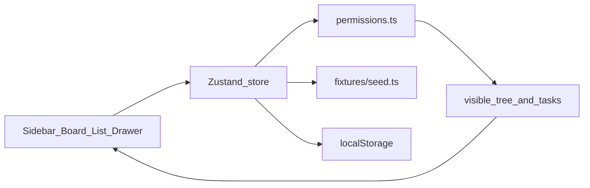

# Flowboard

A single-workspace project board: spaces, folders, and lists, with a kanban board, a list view, and a small permission model. There is no backend. Data lives in a Zustand store seeded from fixtures and saved to `localStorage`.

## Choices

The brief left these open. Here is what I picked, and why.

**No backend — client store + persistence**  
There is no API. All data lives in a typed Zustand store, seeded from `src/fixtures/seed.ts`. I turned **localStorage persistence on** (key `flowboard-v1`) so a refresh keeps the workspace. Users and grants always reload from the seed, so the Alice / Bob / Carol permission demo cannot be overwritten. Tests create a store with persistence off.

**Archive, not only soft-delete**  
I used **archive** (`archivedAt`) so a space, folder, list, or task can be hidden and later restored. **Delete** is a separate, confirmed action that removes the item for good (and its children or subtasks). Both actions are in the sidebar menu and the task drawer.

**Zustand for mutations**  
The brief allowed Pinia, Zustand, Redux, or a composable. I chose **Zustand**. Pinia is for Vue. Redux would have been more setup than this app needs. Every write goes through the store and returns `{ data }` or `{ error }`, the same shape a real client API would.

**Vite + Tailwind**  
The brief prefers this stack. I used Vite, React 18, TypeScript, and Tailwind CSS 3, then stripped the rest: `src/index.css` is only the three `@tailwind` directives, tokens live in `tailwind.config.ts`, and Headless UI is used unstyled for dialogs and menus. No CSS modules, SCSS, or a styled component library.

## Run locally

```bash
npm install
npm run dev
```

Then open the URL Vite prints (usually `http://localhost:5173`).

```bash
npm test
npm run build
```

`npm test` runs Vitest. `npm run build` typechecks and builds the production bundle.

## Tests

The required coverage is Vitest unit tests plus one Testing Library component test. There is no Playwright or Cypress suite.

| Requirement | Where |
| --- | --- |
| Permission filtering on the tree | `src/store/permissions.test.ts` — Alice sees every list; Bob loses Sprint; Carol loses Design |
| Task access | `src/store/store.test.ts` — Alice can read a Sprint task; Bob gets `FORBIDDEN` on read and update |
| Component | `src/App.test.tsx` — switch Alice → Bob hides Sprint in the sidebar and removes its tasks from the main view |

Sign-in is the **Switch user** button in the top bar (also under the account chip). Start as Alice (admin), then switch to Bob: Sprint disappears and the modal copy explains why. That difference is meant to be demoable in under 30 seconds.

If the board gets into a bad local state, open the account chip and choose **Reset demo data**.

## Architecture



| Piece | Role |
| --- | --- |
| `src/fixtures/seed.ts` | One workspace, two spaces, two folders, three lists, 18 tasks, three users, two grants |
| `src/store/permissions.ts` | Pure visibility rules used by selectors and mutations |
| `src/store/store.ts` | Zustand factory plus the app singleton. Mutations return `{ data }` or `{ error: { code, message } }` |
| `src/store/selectors.ts` | Tree children, task filters, search, and sort |
| `src/components` | Sidebar, top bar, kanban, list, task drawer, toasts |

The store is created with `createFlowboardStore()`. The app uses the `flowboard` singleton. Tests create isolated stores with persistence and the boot delay turned off.

## Data model

Containers form one tree. A list can sit in a space or in a folder:

```text
Workspace
└── Space
    ├── List
    └── Folder
        └── List
            └── Tasks
```

Every container has `id`, `name`, `type`, `parentId`, `position`, `visibility` (`public` or `private`), `defaultPermission` (`full` or `view`), and `archivedAt`. A list is the only container that holds tasks. Sibling order is `position`.

Each list owns three statuses: To do (`todo`), In progress (`in_progress`), and Done (`done`). A status has `id`, `listId`, `name`, `category`, `color`, and `position`. A task's `statusId` must belong to its list.

A task has `title` (required, max 500 characters), `description`, `primaryListId`, `statusId`, `priority` (`urgent | high | normal | low | none`), `assigneeIds`, `dueDate`, `position`, `parentTaskId`, `createdAt`, and `updatedAt`. Subtasks are one level deep.

Archive (`archivedAt`) hides a space, folder, list, or task without removing it. Archived tasks drop out of the list, the board, and search; they stay reachable through the **Archived** button next to the view tabs. Restoring a task also brings back the subtasks that were archived with it, and a subtask restored on its own brings back its parent so it has somewhere to appear. The restored task goes to the end of its status column.

Delete is permanent. Deleting a space, folder, or list removes that node, its descendants, and their tasks and statuses. Deleting a task also removes its subtasks. Both actions sit next to each other in the sidebar menu and the task drawer, and both ask for confirmation.

The workspace can be renamed by an admin (click the name in the sidebar header). It cannot be archived or deleted, because this demo is a single workspace.

Archived spaces, folders, and lists stay in the sidebar for admins, dimmed, with restore, delete, and an X that hides that row. The **Archived** toggle next to Spaces brings hidden rows back. Members do not see archived containers. Restoring a folder or space brings its children back into the tree.

The store remembers containers, statuses, tasks, the current user, the selected list, and the current view in `localStorage` under `flowboard-v1`. Users and grants always come from the seed so the permission demo cannot be overwritten. Compose-task flags are session-only and are not persisted. The first load and each list switch wait briefly so the skeleton state is visible.

## Permissions

Checks run in `canViewContainer` and in every mutation. The UI only renders what the selectors return.

For a member, every ancestor including the node itself must pass:

- an explicit `deny` grant hides it
- a `private` container is visible only with an explicit `allow` grant
- a `public` container stays visible when neither of those fails
- an archived ancestor hides the node

Admins bypass grants. They still do not see archived nodes.

Grants do not cascade. Bob's allow on the private Design space does not reveal a private child. A public list under a space he cannot see stays hidden. Carol has no grants, so she sees the public Engineering lists (including Sprint) and not Design.

Create Space / List / Folder only collect a name (and an optional description). Visibility and default permission are not set in those dialogs. Seeded Design is private with Bob allowed; Bob is denied on Sprint. The store still accepts `defaultPermission: "view"` on `createContainer` so a view-only space can be created in tests: members can open its lists and read the tasks, but every task write on them returns `FORBIDDEN` with "This space is view only." The flag is inherited by descendants and admins ignore it. Spaces without the flag, including every seeded one, behave as **Full edit**.

Alice can create, rename, archive, delete, and reorder containers (and rename the workspace). Bob and Carol can edit tasks only on lists they can see. A container change, or a task read/update on a hidden list, returns `{ error: { code: "FORBIDDEN", message } }`. Other codes are `NOT_FOUND` and `VALIDATION`. Switching users clears a selection they cannot keep and shows that error in a toast.

A kanban or list drop updates the store immediately, then rolls the tasks back if the permission check fails. React usually paints only the final state; the store test records both snapshots.

To extend this later: add group grants, make an allow on a space cover its public descendants explicitly, and enforce the same checks on a server with the client store as a cache.

## Stretch goals

Attempted three:

1. **Client-side search** on task title and description (a parent also matches when a subtask matches)
2. **Optimistic drag-and-drop**, with rollback when the store rejects the move (including a permission deny)
3. **Bulk update** — multi-select in list view, then change status, assignee, or priority

Not attempted: activity feed, keyboard shortcuts, deployed preview, Storybook, pagination, a status editor.

## What shipped besides the MVP

- Optimistic drag-and-drop with rollback when the store rejects the move, on both the board and the list
- Client-side search on task title and description
- Bulk update in list view (status, assignee, priority)
- One level of subtasks: hover **+** on a parent (kanban card or list row) opens a composer with assignee, due date, priority, Save, and Cancel; subtasks get a pencil to rename
- A ClickUp-style list: tasks grouped by status (or assignee, priority, or due), a header row, and Add Task inside a group
- Board and list Group by with a subgroup, each with its own sort direction
- An archived-tasks panel per list that restores or permanently deletes a task
- A row menu in the sidebar that keeps Rename, Archive, and Delete behind a three-dot button
- A `+` on every sidebar row that opens a Create menu: List or Folder open a modal; Task on a list opens the To do composer in that list (no modal)
- Create a Space / List / Folder dialogs with a name and optional description (no default-permission or private toggles)
- A Themes item in the user menu that opens a Customize dialog for Light / Dark / Auto and an accent color
- A persistent **Switch user** control in the top bar (and the same action in the account menu) to pick Alice, Bob, or Carol
- Archived spaces, folders, and lists stay in the sidebar so an admin can restore them
- A desktop-first responsive layout: overlay sidebar, wrapping top bar, and horizontal scroll on the list and board

## Trade-offs

Cut for this pass: pagination, a status editor, an activity feed, keyboard shortcuts, Storybook, and a deployed preview. Create dialogs do not set visibility or default permission; private / deny / allow behavior is demonstrated with the seed (Design private, Sprint denied for Bob). A view-only space can still be created through the store API for tests.

The workspace cannot be archived or deleted. Task descriptions are plain text. Opening a list or a task is not routed, so a refresh closes the drawer.

Next week I would add a status editor per list, cursor pagination on the list view, and route URLs for the selected list so a refresh keeps the drawer open.

## UX and look & feel

Styling is Tailwind only. `src/index.css` has the three `@tailwind` directives. Colors, type, radius, and shadow are theme tokens in `tailwind.config.ts`. The only component library is Headless UI, styled with those tokens. There are no CSS modules, SCSS, or CSS-in-JS.

The chrome is one product: sidebar, top bar with a persistent user switcher, and the main list or board. Priority flags and status marks use the same token classes on kanban cards and list rows. The layout is desktop-first and responsive: below `md` the sidebar becomes an overlay, the search field wraps, and the list/board scroll horizontally instead of crushing columns.

| Area | Where it lives |
| --- | --- |
| Loading | `TreeSkeleton` on first load, `BoardSkeleton` on list switch |
| Empty | `EmptyState` when no list is selected, the selected list has no tasks, or search matches nothing; kanban columns still show "No tasks" |
| Errors | `ToastViewport` for failed mutations, including `FORBIDDEN` |
| Feedback | Shared `focusRing`, hover, and `data-[open]` / `data-[focus]` on tree rows, cards, and menus |
| DnD | Drag preview via `DragOverlay`, drop column highlight, store write with rollback |
| Detail | Task drawer is a Headless UI dialog: click the list row (or the card) to open; Escape and overlay click close it |

## Drag-and-drop styles

`@dnd-kit` needs `transform` and `transition` on the dragged node. The sidebar width, the edge tooltip's vertical position, and the task drawer width are the other inline `style` values. Those are the only inline `style` values.

## AI usage

Cursor helped scaffold the app, the store, and the first tests. Corrections and rejected ideas are in [AI_USAGE.md](./AI_USAGE.md).

## Stack

React 18, TypeScript, Vite, Zustand, Tailwind CSS 3, Headless UI (dialog and menu), dnd-kit, Vitest, and Testing Library.
